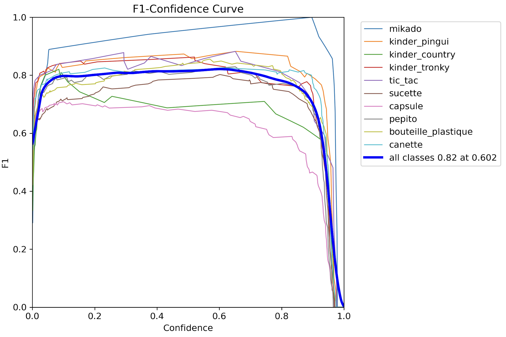

# Projet SMART - Rapport

L’objectif du projet SMART est développer un projet en Python capable d’utiliser la
Computer Vision pour reconnaitre automatiquement un ensemble défini de produits. La
détection se fera soit sur une image, soit sur une vidéo, soit sur le flux caméra d’un
ordinateur en temps réel.

## Expérimentations menées

### Experiment n°1 ([real_exp_10_yolo_s](https://app.picsellia.com/0192f6db-86b6-784c-80e6-163debb242d5/project/01936425-704a-7d93-b1bb-1b1641812ba4/experiment/0194d7c2-3718-76f0-b280-26eb28edd7cc/))

#### Paramètres :
- Modèle : YOLOv11-S
- Epochs : 400
- Paramètres par défaut

#### Résultats :
| Métrique   | Valeur finale | Maximum atteint  |
|------------|---------------|------------------------------------------|
| Précision  | 0.84          | 0.89                                     |
| Recall     | 0.65          | 0.70                                     |
| mAP50      | 0.76          | 0.77                                     |
| mAP50-95   | 0.62          | -                                        |

Les différentes loss pendant le training :

| box_loss                                                         | cls_loss                                                         | dfl_loss                                                         |
|------------------------------------------------------------------|------------------------------------------------------------------|------------------------------------------------------------------|
|  |  |  |

#### Observations :
- Sur-apprentissage détecté à partir de la 30e epoch.
- Une stratégie d’arrêt précoce pourrait être envisagée.

### Experiment n°2 ([real_exp_11_yolo_l](https://app.picsellia.com/0192f6db-86b6-784c-80e6-163debb242d5/project/01936425-704a-7d93-b1bb-1b1641812ba4/experiment/0194e272-62f8-7d4b-82ce-21cd06f6100e/))

#### Paramètres :
- Modèle : YOLOv11-L
- Epochs : 50
- Paramètres par défaut

Les différentes loss pendant le training :

| box_loss                                                   | cls_loss                                                   | dfl_loss                                                   |
|------------------------------------------------------------|------------------------------------------------------------|------------------------------------------------------------|
|  |  |  |

#### Observations :
- Modèle trop lourd et long à entraîner.
- Résultats décevants, recall et précision très faibles.
- Matrice de confusion très mauvaise.

### Experiment n°3 ([real_exp_12_yolo_m](https://app.picsellia.com/0192f6db-86b6-784c-80e6-163debb242d5/project/01936425-704a-7d93-b1bb-1b1641812ba4/experiment/0194e4dd-d8d8-7061-ab50-9b34e8e59523/))

#### Paramètres :
- Modèle : YOLOv11-M
- Epochs : 100
- Paramètres par défaut

#### Résultats :
| Métrique   | Valeur finale | Maximum atteint |
|------------|---------------|----------------------------------------|
| Précision  | 0.72          | 0.80 (12ème epoch)                     |
| Recall     | 0.42          | 0.49 (90ème epoch)                     |
| mAP50      | 0.53          | -                                      |
| mAP50-95   | 0.40          | -                                      |

Les différentes loss pendant le training :

| box_loss                                                   | cls_loss                                                   | dfl_loss                                                   |
|------------------------------------------------------------|------------------------------------------------------------|------------------------------------------------------------|
|  |  |  |

#### Observations :
- Améliorations possibles en poursuivant l’entraînement (ajout de 100 epochs supplémentaires).

### Experiment n°4 et n°5 ([real_exp_13_yolo_m](https://app.picsellia.com/0192f6db-86b6-784c-80e6-163debb242d5/project/01936425-704a-7d93-b1bb-1b1641812ba4/experiment/0194e552-fd8a-7653-a191-b30dfbc1eb09/), [real_exp_14_yolo_m](https://app.picsellia.com/0192f6db-86b6-784c-80e6-163debb242d5/project/01936425-704a-7d93-b1bb-1b1641812ba4/experiment/0194e6dd-dae1-75cf-a3bd-bb0d53054008/))

#### Paramètres de l'entrainement n°4
- Modèle : Experiment n°3
- Epochs : 100
- Patience : 20
- Paramètres par défaut

Les différentes loss pendant le training de l'experiment n°4 :

| box_loss                                                   | cls_loss                                                   | dfl_loss                                                   |
|------------------------------------------------------------|------------------------------------------------------------|------------------------------------------------------------|
|  |  |  |

#### Paramètres de l'entrainement n°5
- Modèle : Experiment n°4
- Epochs : 100
- Patience : 20
- Paramètres par défaut

Les différentes loss pendant le training de l'experiment n°5 :

| box_loss                                                   | cls_loss                                                   | dfl_loss                                                   |
|------------------------------------------------------------|------------------------------------------------------------|------------------------------------------------------------|
|  |  |  |

#### Observations :
- Les deux expériences ont été menées sur 100 epochs avec une patience de 20. L’expérimentation n°4 a atteint les 100 epochs, tandis que la n°5 s’est arrêtée après 60 epochs en raison du critère d’arrêt précoce.
- Une divergence des pertes a été observée, plus prononcée sur l’expérimentation n°5, suggérant un sur-ajustement du modèle.
- Les résultats obtenus ne sont pas pleinement satisfaisants, indiquant un besoin d’optimisation supplémentaire.
- Une nouvelle expérimentation sera menée à partir du modèle M de base en ajustant la learning rate pour améliorer la stabilité des validation loss. Une légère modification de la learning rate finale pourrait être envisagée, car les entraînements précédents montrent une stabilisation progressive en fin de training.

### Résumé des experiments

## Des résultats intéressants

### Experiment n°6 ([real_exp_15_yolo_m_lr](https://app.picsellia.com/0192f6db-86b6-784c-80e6-163debb242d5/project/01936425-704a-7d93-b1bb-1b1641812ba4/experiment/0194e726-a3fe-7ae3-a710-baf712db1ed0/))

#### Paramètres de l'entrainement n°6
- Modèle : YOLOv11-M
- Epochs : 200
- Patience : 20
- lr0 = 0.00179
- lrf = 0.01518

Les valeurs des learning rates proviennent d'un début d'optimisation avec la méthode `model.tune()` de Ultralytics, bien
que nous n'ayons plus les paramètres exacts utilisés pour cette phase d'ajustement. Les résultats obtenus semblent
plutôt bon pour être une base de travail.

Le fait de baisser la learning rate a permis de stabiliser un peu plus les variations des validations loss.

| box_loss                                                   | cls_loss                                                   | dfl_loss                                                   |
|------------------------------------------------------------|------------------------------------------------------------|------------------------------------------------------------|
|  |  |  |

### Observations :
- Fitness de 77.6 % (meilleur score obtenu jusqu’ici).
- Meilleure stabilité des pertes.
- Difficulté avec certaines classes (ex : mikados et capsules).

### Experiment n°7 ([real_exp_16_yolo_m_augm](https://app.picsellia.com/0192f6db-86b6-784c-80e6-163debb242d5/project/01936425-704a-7d93-b1bb-1b1641812ba4/experiment/0194e7f9-6718-76eb-814f-bb28a78a81d5/))

#### Paramètres de l'entrainement n°7
- Modèle : experiment n°6
- Epochs : 100
- Patience : 50
- lr0 = 0.000895
- lrf = 0.00759
- mixup = 0.3
- mosaic = 0.3

L'ajustement en divisant par 2 les learning rates vise à éviter d’effacer les progrès du modèle. L'ajout de mixup et
mosaic permet d'augmenter la complexité des images d'entraînement, en combinant plusieurs images en une et en générant
des mosaïques.

Les différentes loss pendant le training :

| box_loss                                                   | cls_loss                                                   | dfl_loss                                                   |
|------------------------------------------------------------|------------------------------------------------------------|------------------------------------------------------------|
|  |  |  |

Les améliorations sont globalement légères, sauf pour les Mikados, qui perdent 0.13 en score.

| Classe         | Exp n°6 | Exp n°7 | Evolution |
|----------------|---------|---------|-----------|
| Mikado         | 1.0     | 0.87    | - 0.13    |
| Kinder pingui  | 0.78    | 0.86    | + 0.08    |
| Kinder country | 0.60    | 0.70    | + 0.10    |
| Kinder tronky  | 0.80    | 0.78    | - 0.02    |
| Tic Tac        | 0.95    | 0.95    | =         |
| Sucette        | 0.72    | 0.75    | + 0.03    |
| Capsule        | 0.56    | 0.56    | =         |
| Pepito         | 0.77    | 0.80    | + 0.03    |
| Bouteille      | 0.82    | 0.83    | + 0.01    |
| Canette        | 0.76    | 0.74    | - 0.02    |

| Experiment | Fitness |
|------------|---------|
| exp 6      | 77.6 %  |
| exp 7      | 78.4 %  |

Une prochaine experiment pourrait être envisagée en réutilisant le modèle de l'experiment 6 avec d'autres paramètres de
data augmentation.

### Experiment n°8 ([real_exp_17_yolo_m_augm](https://app.picsellia.com/0192f6db-86b6-784c-80e6-163debb242d5/project/01936425-704a-7d93-b1bb-1b1641812ba4/experiment/0194e9ad-af59-70aa-b3f6-ff9284c81521/))

#### Paramètres de l'entrainement n°8
- Modèle : experiment n°6
- Epochs : 30
- Patience : 10
- lr0 = 0.000895
- lrf = 0.00759
- translate= 0.1
- mosaic = 0.1,
- scale=0.5,
- shear=10,
- flipud=0.5

Les différentes loss pendant le training :

| box_loss                                                   | cls_loss                                                   | dfl_loss                                                   |
|------------------------------------------------------------|------------------------------------------------------------|------------------------------------------------------------|
|  |  |  |

| Classe         | Exp n°6 | Exp n°8 | Evolution |
|----------------|---------|---------|-----------|
| Mikado         | 1.0     | 1.0     | =         |
| Kinder pingui  | 0.78    | 0.86    | + 0.08    |
| Kinder country | 0.60    | 0.70    | + 0.10    |
| Kinder tronky  | 0.80    | 0.78    | - 0.02    |
| Tic Tac        | 0.95    | 0.95    | =         |
| Sucette        | 0.72    | 0.76    | + 0.04    |
| Capsule        | 0.56    | 0.69    | + 0.13    |
| Pepito         | 0.77    | 0.73    | - 0.04    |
| Bouteille      | 0.82    | 0.85    | + 0.03    |
| Canette        | 0.76    | 0.79    | + 0.03    |

| Experiment | Fitness |
|------------|---------|
| exp 6      | 77.6 %  |
| exp 7      | 78.4 %  |
| exp 8      | 81.1 %  |

Avec ces paramètres, on obtient de bien meilleurs résultats. Certes, certaines classes ont diminué, mais cette diminution
est bien faible par rapport aux gains enregistrés sur les autres classes.

On pourrait essayer une dernière experiment en augmentant les paramètres de celle-ci et en supprimant la patience.
Pour voir ce que cela donne, il faudrait aller au bout des 30 epochs sur le modèle de l'experiment 6.

### Experiment n°9 ([real_exp_18_yolo_m_augm](https://app.picsellia.com/0192f6db-86b6-784c-80e6-163debb242d5/project/01936425-704a-7d93-b1bb-1b1641812ba4/experiment/0194e9ec-cbdd-78d9-9e68-6f235e19a0b0/))

#### Paramètres de l'entrainement n°9
- Modèle : experiment n°6
- Epochs : 30
- Patience : 0
- lr0 = 0.000895
- lrf = 0.00759
- translate= 0.1
- mosaic = 0.1,
- scale=0.5,
- shear=10,
- flipud=0.5

| Classe         | Exp n°6 | Exp n°9 | Evolution |
|----------------|---------|---------|-----------|
| Mikado         | 1.0     | 0.87    | - 0.13    |
| Kinder pingui  | 0.78    | 0.84    | + 0.06    |
| Kinder country | 0.60    | 0.65    | + 0.05    |
| Kinder tronky  | 0.80    | 0.78    | - 0.02    |
| Tic Tac        | 0.95    | 0.84    | - 0.11    |
| Sucette        | 0.72    | 0.69    | - 0.03    |
| Capsule        | 0.56    | 0.59    | + 0.03    |
| Pepito         | 0.77    | 0.76    | - 0.01    |
| Bouteille      | 0.82    | 0.78    | - 0.04    |
| Canette        | 0.76    | 0.72    | - 0.04    |

| Experiment | Fitness |
|------------|---------|
| exp 6      | 77.6 %  |
| exp 7      | 78.4 %  |
| exp 8      | 81.1 %  |
| exp 9      | 75.2 %  |

Avec cette experiment, le modèle est bon que l'original.

### Résumé des experiments

## Tableau récapitulatif des expérimentations

| Expérience  | Modèle         | Epochs | Fitness (%) | Observations principales |
|-------------|---------------|--------|-------------|--------------------------|
| Exp 1       | YOLOv11-S      | 400    | 76.0        | Sur-apprentissage rapide |
| Exp 2       | YOLOv11-L      | 50     | 65.0        | Modèle trop lourd        |
| Exp 3       | YOLOv11-M      | 100    | 72.0        | Performances correctes   |
| Exp 6       | YOLOv11-M LR   | 200    | 77.6        | Stabilité améliorée      |
| **Exp 8**   | **YOLOv11-M Augm** | **30**  | **81.1**  | **Meilleure performance**

## Conclusion
Nous avons décidé de conserver le modèle de **l’expérimentation n°8**, qui offre les meilleurs résultats obtenus jusqu’à
présent. Il serait possible de poursuivre le fine-tuning pour améliorer encore les performances, mais le modèle actuel
est déjà plutôt correct.

Une autre méthode aurait été d’utiliser de manière plus pousée la méthode `model.tune()` de Ultralytics pour rechercher les meilleurs hyper-paramètres automatiquement. Nous avons testé cette méthode, mais celle-ci demande
beaucoup de ressources, ce qui n'était pas envisageable dans notre cas (à moins de louer 4 RTX 4090, mais bon ... 💸🐀).

Finalement, nous avons décidé de partir des paramètres par défaut proposés par Ultralytics, qui sont vraiment bons, et d'ajouter des data
augmentations nous a permis d’obtenir un modèle aux performances plutôt correctes sans nécessiter un tuning automatique
trop coûteux.

|                  | Lien                                                                                                                                                                   |
|------------------|------------------------------------------------------------------------------------------------------------------------------------------------------------------------|
| Meilleur modèle  | [model_latest](https://app.picsellia.com/0192f6db-86b6-784c-80e6-163debb242d5/model/01936429-42c2-7152-8cd1-ba068fa9d87a/version/0194e9b9-36a7-7580-ae8d-b307e8a03c0d) |
| Autre bon modèle | [model_latest](https://app.picsellia.com/0192f6db-86b6-784c-80e6-163debb242d5/model/01936429-42c2-7152-8cd1-ba068fa9d87a/version/0194c29a-b7fc-709f-8a81-af438610aa38) |
